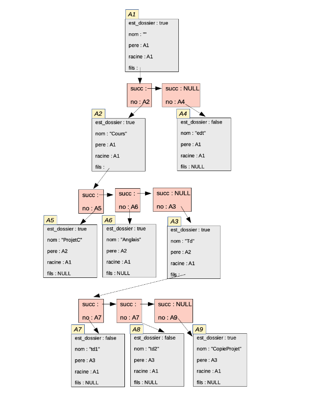

# TreeDir 
[](https://skills.thijs.gg)

For the french version of readme click [](https://github.com/yactam/TreeDir/blob/main/README.fr.md)


## Description

TreeDir is our first project using <b>The C programming language</b> which is a a program that simulates tree manipulation system instructions
folders/files. The program will take as input a file containing a list of instructions
and will have to simulate these instructions by manipulating a 'tree' stored in memory. The program will move
in the tree structure, will be able to create folders/files, move, copy or delete folders/files.

## Example of the manipulated structure



## Compile

A Makefile is provided in the project, just lunch this command in the terminal:
```bash
    $ make all 
```

## Execute 

After compiling just run:

```bash
    $ ./treedir
```
